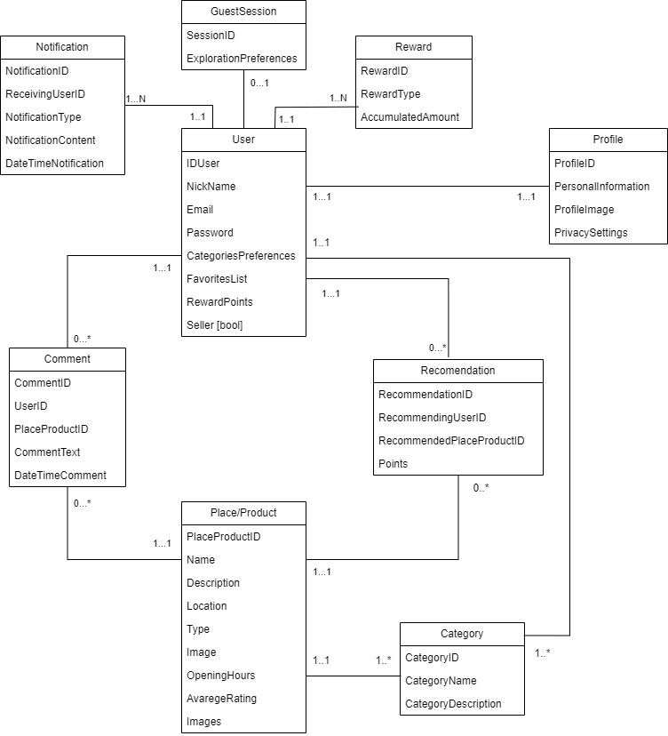

# Propuesta TP DSW

## Grupo

### Integrantes
- 46876 - Zinni, Gonzalo.
- 51742 - Quaglia, Mateo.

## Tema
# DISCOVER IT

## Descripción del Proyecto:

DISCOVER IT es una aplicación que utiliza algoritmos de recomendación para sugerir lugares, restaurantes, música y eventos en función de las preferencias del usuario. Incorpora funciones como notificaciones personalizadas y capacidades de calificación, lo que permite a los usuarios descubrir experiencias relevantes de manera más eficiente.

### Modelo

## Alcance Funcional 

### Alcance Mínimo

